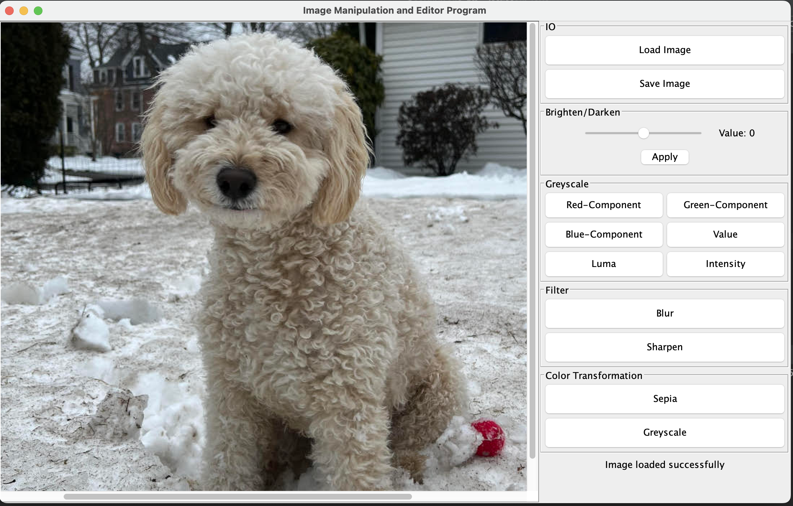

# GRIME - Graphical Image Manipulation and Enhancement - README
Nicole Quinn\
quinn.nic@northeastern.edu

## Overview
Below is an image to show what the program looks like when run: 

## High Level Design
This program uses the MVC design pattern to construct an image manipulation and enhancement program. Each of the three components are discussed below:
### Model:
In this program, the model represents an image database. This database is where images can be both stored and retrieved. 
Prior to building this model database, I had to start at the base level of an image. At the base level of an image are the pixels. 
For a PPM image specifically, there are 3 pixel values, RGB. Pixels are what make up the image itself. I have described these interfaces and classes below:
* **IPixelState, IPixel, and PixelImpl**
  * The IPixelState interface represents operations that can be used to get the pixel values for RGB from the image, without changing it. This interface contains getter methods.
  * The IPixel interface represents the setting operations that can be performed to update the values of individual pixel components. This interface extends IPixelState.
  * The PixelImpl class implements the IPixel interface. This class represents an image pixel that is represented by RGB values.

* **IMageState, IImage, and ImageImpl**
    * The IMageState interface represents an image and performs operations to access components of the image. This interface contains getter methods.
    * The IImage interface represents an image and performs operations to set components of the image. This interface extends IMageState.
    * The ImageImpl class implements the IImage interface. This class represents an image and performs operations to access and set components of the image.

Now that we have created an individual pixel object and an image object that consists of pixels in a 2D array, we then create the model interface and class 
whose purpose is to store and retrieve these image objects from the database. The model does so by using a hashmap. 

* **IModel and ModelImpl**
    * The IModel interface represents an image database that allows image storage and retrieval.
    * The ModelImpl class represents an image storage database model. This interface implements IModel.
    * By setting up the model in this way, we can allow the model to store any image object type in the hashmap, and we are not restricted to PPM image types. 

* **Transformations**
    * The last components of the model package are the transformations. These transformations live in their own separate packages. Within the package, there is a transformation
      interface and the implementing transformation classes. Each of these classes represent different editing and manipulation transformations that can be performed on an image object.
      The transformation package represents an implementation of the strategy pattern. By setting up the transformations in this way, we allow for more flexibility in the event that additional
      itself changes to the program are needed.
    * Clamp
      * Clamp is a new abstract class created during this assignment. The functionality to clamp max and min pixel channel values remains the same. However, I minimized code duplication by abstracting
        the class out since it was in all of the transformation classes
* **IKernelState, IKernel, and KernelImpl**
  * The IKernelState interface represents an image filtering kernel and performs operations to access components of the kernel. This interface contains getter methods.
  * The IKernel interface represents an image filtering kernel and performs operations to set the values of the kernel. This interface extends IKernelState.
  * The KernelImpl class represents an image filtering kernel and performs operations to access and set components of the kernel. It implements the IKernel class 
    and implements all operations mandated by the IKernelState and IKernel interfaces.

### Controller:
At it's core, the controller is responsible for sitting between the model and the view and transmitting input between the two. This program supports two different controller implementations. 
* **Text-Based Command Controller:**
  * The text-based command controller takes in and parses text commands in specific formats (specified below) and executes them. 
  * To make the controller more streamlined and also due to the volume of commands needed, I decided to implement a command pattern. Rather than having a bunch of switch statements in the controller to parse the command line arguments and determine which 
  command is being called, I created a separate commands package that contains a command interface and implementing classes for each command type.
* **GUI Controller:**
  * The GUI controller sits between the model and a GUI view. It acts as a listener to view events and executes the events when called upon. It leverages the transformation classes directly rather than calling to the 
    command classes since no parsing of input is required. 

The core elements of the controller package are detailed below:

* **IController, ControllerImpl, and GUIController**
  * The IController interface represents a controller for the Image Manipulation and Editor (IME) program.
  * The ControllerImpl implements the IController interface and contains the implementation for the core run method for text based commands.
  * The GUIController implements the IController and ViewListener interfaces. This class represents a controller specific to the GUI.

* **ImageUtil**
  * Utility class providing methods for image-related operations.
  * Contains 2 methods:
    * getFileExtension which returns the file extension from a given file path.
    * createBufferedImage which returns a buffered image object created from given IImageState object.

* **IO Package**
  * IImageLoader Interface, PPMImageLoader class, and OtherImageLoader class - The interface represents an image loader that will load an image to a specified file path. By creating an interface with a simple
  run method, we allowed for the flexibility to accommodate other file types as was implemented in the OtherImageLoader class. The PPMImageLoader and OtherImageLoader represent image loaders. They implement the 
  IImageLoader interface and implements the mandated operation. When initialized and ran, it loads an image to specified file path.
  * IImageSaver Interface, PPMImageSaver class, and OtherImageSaver - The interface represents an image saver that will format and save an image object in its required format. By creating an interface with a simple
  run method, we allowed for the flexibility to accommodate other file types as was implemented in the OtherImageSaver class. The PPMImageSaver and OtherImageSaver represent image savers. They implement the IImageSaver interface and implements the mandated operation. When initialized 
  and ran, it saves a given image to a specified file path.
  
* **Commands Package**
  * The commands package contains the ICommands interface that contains only one method. From there, we have implementing classes for each editing transformations, load, and save. Since the command scripts to call various transformations vary,
    we can now house the individualized command script parsing in each of the command's own class. Within each of these classes, once the script is successfully parsed, it can then call on it's corresponding transformation or IO class to perform that action needed.

These commands are then put into a command hashmap that is initialized in the ControllerImpl. From there, we can put the commands in the hashmap and leverage the getOrDefault method to parse the given command script
and call the appropriate command pattern. In the future if more commands are needed, we can easily create those separately.

### View:
This program supports two different view implementations.
* **Text-Based View:**
  * The view in this assignment is responsible for rendering message to the user. If a command is performed successfully or if there is an error with the command script provided
  the controller will write this to the text view and the view will transmit this output to the user.
* **GUI View:**
  * The IME GUI provides a user interface for loading, editing, and saving images. It offers various features such as image brightening/darkening, greyscale operations, and applying filters. 
    Users can interact with the GUI through buttons and sliders. Any feedback messages to the user are visible on the GUI screen.

* **ImageView and ImageTextView**
  * The ImageView interface represents operations that should be offered by a text view for an Image.
  * The ImageTextView class implements the ImageView interface and contains the implementation for the render message method.

* **IGUIView and GUIView**
  * The IGUIView interface represents a GUI. It contains methods that all establish a GUI and allow for the setting of elements to it.
  * The GUIView class represents an Image Manipulation and Editor (IME) GUI. As mentioned above, it provides a user interface for loading, editing, and saving images.

* **ICanvas and Canvas**
  * The ICanvas interface represents a canvas that displays images.
  * The Canvas class represents a graphical area where images can be displayed. It extends the JPanel class and implements the ICanvas and Scrollable interfaces to provide image setting and scrolling 
   functionality if the image dimensions exceed the canvas dimensions.
  * The canvas allows the GUI view to display the current image being worked on.

* **ViewListener**
  * The ViewListener interface represents a view listener that contains methods that represent actions or events that the view can trigger. The methods in the interface are intended to be called 
   by the view to inform the listener (controller) about different user actions or events that occurred in the view. The controller can then execute these events with the given info.
  * For each emit event in the GUiVIew there is a corresponding handling event in the view listener interface.  

### IMEMain:
The main in this iteration acts as an interactive image editor that takes in keyboard commands, commands via a .txt file, or provides an interactive GUI. The main can be run in the following ways:
* "-file fileName.txt" - when this command line configuration is invoked in this manner the program should open the script file, execute it and then shut down.
* "-text" - when this command line configuration is invoked in this manner the program should open in an interactive text mode, allowing the user to type the script and execute it one line at a time.
* When no command line configuration is selected, the program will open up the GUI.

### Change Log: Since Assignment 9
* No changes were made to the existing code from the previous 2 assignments, however, additions were made to the program in order to implement a GUI. Those changes are detailed below and have been added tp
the descriptions above. 
  * New GUIController class to represent a GUI specific controller.
  * New ImageUtil class to minimize clutter/code repetition to provide methods for image-related operations.
  * New ICanvas interface and Canvas class to represent canvas for drawing image within the view.
  * New IGUIView interface and GUIView class to represent interactive GUI
  * New ViewListener interface that contains methods that represent actions or events that the view can trigger.
  * Testing for ImageUtil class.
  * Testing using mock view to verify images were being transmitted correctly between controller and view.

## Instructions: How to run the program
There are now three different ways to run main:
* To run the program via the keyboard, navigate to `IMEMain` in the `src/` folder. Once here, create a command line configuration where "-text" is the command.
  * Enter in command scripts one at a time as provided below. After entering in one command, press enter on your keyboard. The program will provide feedback
  if the command was successful. If you saved an image, you can locate that in the file path you provided. 
* To run the program via a .txt file containing a list of commands, you must create a command line configuration. When specifying the command line to run,
  please make sure it follows this format "-file fileName.txt". Please be mindful that IMEMain is in the src/ folder so you will need to use the correct file paths both for the .txt script and also within the script itself. 
  * Once the command line configuration is complete, you can run that configuration. You should see your files saved in the location specified. 
* To run the program via the GUI, navigate to `IMEMain` in the `src/` folder. Once here, run the main by selecting the run button in the top right corner. Make sure the current file is selected.

**Text Command Examples**

List of example test commands:
* `load image-path image-name`
  * load an image from the given image path and provide it with an image name that will be its ID moving forward.
* `save image-path image-name`
  * save the image with the given image name to the provided file path.
* `brighten increment image-name dest-image-name`
  * brighten the image by the given increment to create a new image, referred to henceforth by the given destination name. The increment may be positive (brightening) or negative (darkening).
* `red-component image-name dest-image-name`
  * Create a greyscale image with the red-component of the image with the given name, and refer to it henceforth in the program by the given destination name. Similar commands for green-component, blue-component, value, luma, intensity components should be supported.
* `blur image-name dest-image-name`
  * Create a blurred image of the image with the given name, and refer to it henceforth in the program by the given destination name. Similar commands for sharpen, sepia, and greyscale should be supported. 
* Please reference the USEME.md file for a complete list 

**Text Command Examples: Used in Program**
* Brighten 
  * `load res/strawberry.ppm strawberry` 
  * `brighten 30 strawberry strawberryBrighten`
  * `save res/strawberryBrighten.ppm strawberryBrighten`
* Intensity
  * `load res/strawberry.ppm strawberry`
  * `intensity strawberry strawberryIntensity`
  * `save res/strawberryIntensity.ppm strawberryIntensity`
* Blue Component
  * `load res/strawberry.ppm strawberry `
  * `blue-component strawberry strawberryBlue-Component`
  * `save res/strawberryBlue-Component.ppm strawberryBlue-Component`

**Command Examples: Command Sequence**
  * `load res/strawberry.ppm strawberry`
  * `brighten 30 strawberry strawberryBrighten`
  * `save res/strawberryBrighten.ppm strawberryBrighten`
  * `intensity strawberry strawberryIntensity`
  * `save res/strawberryIntensity.ppm strawberryIntensity`
  * `blue-component strawberry strawberryBlue-Component`
  * `save res/strawberryBlue-Component.ppm strawberryBlue-Component`

Please note: If using this command sequence, the saved images will just write over the existing files since the file path is the same.
Please update the file path in the save commands if you want to save elsewhere or with a different name.

FOR MORE INFORMATION ON ACCEPTED COMMANDS AND USING THE GUI, PLEASE REVIEW THE USEME.md FILE.

## Image Citations

Any photo listed below with myself as the source was created by me. I had taken these photos on my phone. I then 
cropped it and uploaded to GIMP. In GIMP, I reduced the photo size and exported as various file types. The other photo used for testing was
obtained from the website provided below:

* strawberry.ppm
  * Source: Nicole, Q.(2023).Strawberry[Image]
* logan.jpeg
  * Source: Nicole, Q.(2023).Logan[Image]
* bagel.jpeg
  * Source: Nicole, Q.(2023).Bagel[Image]
* fourbyfour.ppm
  * Source: Kirlin, P.(2019).Four by Four[Image].. Retrieved from https://www.cs.rhodes.edu/~kirlinp/courses/cs1/f19/projects/proj8/
* twobytwo.ppm
  * Source: Nicole, Q.(2023).Twobytwo[Image]
  * Adapted from fourbyfour.ppm above
